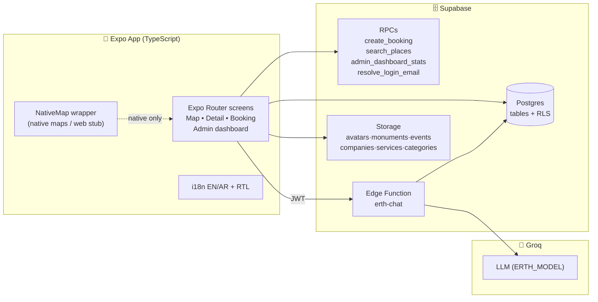

<div align="center">


# 🇯🇴 Jordan Tourism Guide

### دليل السياحة الأردنية — Discover Jordan, from Petra to Aqaba

[](https://expo.dev)
[](https://reactnative.dev)
[](https://supabase.com)
[](https://www.typescriptlang.org)
[](#-license)


**A production-ready, map-first tourism platform for Jordan** — tourists explore monuments, events and local businesses on a live map, book experiences with transactional integrity and dynamic smart pricing, and chat with **Erth / إرث**, an AI guide grounded in real database prices. Admins manage everything from a dedicated dashboard with live stats.

</div>

---

## 📑 Table of Contents

- [✨ Highlights](#-highlights)
- [📱 Tourist App](#-tourist-app)
- [🛡️ Admin Dashboard](#️-admin-dashboard)
- [💰 Smart Pricing Engine](#-smart-pricing-engine)
- [🎫 Booking System](#-booking-system)
- [🤖 Erth AI Guide](#-erth-ai-guide)
- [🏗️ Architecture](#️-architecture)
- [🛠️ Tech Stack](#️-tech-stack)
- [📁 Project Structure](#-project-structure)
- [🚀 Getting Started](#-getting-started)
- [🔐 Roles & Permissions](#-roles--permissions)
- [🧪 Testing](#-testing)
- [📦 Builds & Deployment](#-builds--deployment)
- [🗄️ Database](#️-database)
- [🌍 Internationalization](#-internationalization)
- [🛟 Troubleshooting](#-troubleshooting)
- [🗺️ Roadmap](#️-roadmap)
- [📄 License](#-license)

---

## ✨ Highlights

| | |
|---|---|
| 🗺️ | **Map-first home** — live markers for monuments, events & companies, user location, Jordan fallback region, preview cards, Google-Maps directions |
| 🔍 | **Signature Map Search** — floating pill → fast bottom-sheet panel, debounced server-side `search_places` RPC (companies + monuments + events, pg_trgm typo-tolerant, ranked exact → prefix → contains → typo) |
| 💸 | **Smart pricing** — demand-driven increases that automatically fund discounts for nearby low-booking events (fair rotation, caps, expiry) |
| 🎟️ | **Transactional bookings** — capacity locks, authoritative server prices, `JOR-YYYY-XXXXXX` human references, notifications |
| 🤖 | **Erth / إرث AI** — Groq-powered guide that answers only from live DB data. Never hallucinates prices |
| ⭐ | **Plus promotions** — paid visibility tiers (PLUS / 7 / 14 / 30 days) with scheduling & discovery ranking |
| 🌐 | **EN + AR with full RTL** — persisted language, RTL-forced layouts, Arabic search (`عمان`) |
| 🔒 | **Security-first** — RLS on every table, server-side role/price/capacity/distance checks, zero secrets in the client |

---

## 📱 Tourist App

### Launch flow
```
Splash 🇯🇴 (centered brand) → Onboarding → Login / Register (username OR email)
→ role routing → Map home (tourist) or Dashboard (admin)
```

### Screens

| Screen | Route | What it does |
|---|---|---|
| 🗺️ Map home | `/(tabs)/map` | Live map, markers, preview cards, floating search, profile chip, settings shortcut |
| 🏛️ Monuments | `/(tabs)/…` + `/monument/[id]` | DB-driven listings, detail with mini-map, favorites, share, aggregated reviews |
| 🎉 Events | `/event/[id]` | Active events with location, price, booking entry |
| 🏢 Companies | `/company/[id]` | Cover, logo, rating, call/website/favorite/share, service list, map |
| 🧭 Services | `/service/[id]` | Live price quote, capacity meter, support-discount badge, date + quantity booking |
| 🎫 My bookings | `/booking/…` | History with `JOR-` references, status tracking, notifications |
| 🤖 Erth AI | `/(tabs)/erth` | Chat guide (Arabic/English), new-chat, persisted history |
| 👤 Profile / Settings | `/(tabs)/profile`, `/settings` | Avatar upload, language switch, account |

### Signature Map Search 🔍
1. Compact floating bar (~90% opaque, subtle border)
2. Tap → Reanimated spring expand into a bottom panel
3. Debounced (250 ms) `search_places` RPC with stale-request cancellation (`reqId`)
4. Ranked results with cover, rating, review count → tap flies the map & opens detail

---

## 🛡️ Admin Dashboard

One home, every category its own page — each with a **← back header** (RTL-aware).

### Dashboard (`/admin`)
- 👋 Greeting + **ADMIN / BOSS** badge
- 📊 **Overview stats grid** from the real `admin_dashboard_stats` RPC (bookings, revenue, users, capacity…)
- 🧭 **Manage grid** — big icon buttons into each section:

| Section | Route | Manages |
|---|---|---|
| 🏢 Companies | `/admin/companies` (+ create) | Business listings, active flag, media |
| 🎉 Events | `/admin/events` (+ create) | Events, dates, capacity |
| 🧭 Services | `/admin/services` (+ create) | Experiences, base price, max booking |
| 🗂️ Categories | `/admin/categories` (+ create) | Monument categories |
| 🎫 Bookings | `/admin/bookings` | All bookings + customer names, Confirm/Reject/Cancel/Complete via secure RPC (writes audit log + notification) |
| 💲 Pricing | `/admin/pricing` | `pricing_rules` thresholds & increase % |
| 🎁 Discounts | `/admin/discounts` | Manual/support discount records |
| ⭐ Service Plus | `/admin/event-promotions` | PLUS/7/14/30-day promotion tiers, scheduling |
| 🗺️ Support Pricing | `/admin/support-pricing` | Red-source / green-target map of live allocations |
| ✍️ Reviews | `/admin/reviews` | Moderate tourist reviews |
| 📜 Activity Logs | `/admin/activity` | Own actions vs all (boss) |
| 👑 Administrators | `/admin/administrators` | Roles (boss only — deactivate preferred over delete) |
| ⚙️ Settings / 👤 Profile | `/admin/settings`, `/admin/profile` | App settings, admin account |

> First boss bootstrap: `insert into user_roles (user_id, role) values ('<uid>','boss_admin')`, then manage everyone from Administrators.

---

## 💰 Smart Pricing Engine

Demand pays it forward: when a popular experience fills up, its increase **funds discounts for nearby quiet events**.

```
capacity% = current_booking / max_booking × 100
        │
        ▼
thresholds → increase%   (0 / 3 / 10 / 15 / 20 — DB-configurable in pricing_rules)
        │
dynamic = base_price + increase
        │
increase% ──► nearby eligible event (≤ 25 km Haversine, active,
              capacity 0–70%, fair rotation)
                    │
        target final = max(dynamic − discount, 0)
                    │         (max cap, stacking flag, expiry enforced)
                    ▼
        no eligible target → pending_allocation
```

All computed server-side in `calculate_price_quote` / `allocate_support_discount` / `create_booking` — the client can never invent a price.

---

## 🎫 Booking System

- **Transactional `create_booking` RPC** — locks capacity row, re-computes the authoritative price, snapshots it on the booking, generates a human reference like `JOR-2026-AB1234`
- Quantity + date selection, capacity meter (`current/max`), support-discount badge
- Status lifecycle via `admin_set_booking_status` RPC: `pending → confirmed / rejected / cancelled / completed` — each change writes an **audit log** and a **user notification** server-side
- Tourist history + admin-wide bookings list with customer names resolved via a second scoped query (no fragile cross-schema embeds)

---

## 🤖 Erth AI Guide

Erth / إرث is a secure Edge Function — the AI key **never leaves the server**.

```
App (logged-in tourist JWT) ──POST──▶ erth-chat Edge Function
                                         ├─ verify JWT → 401 if anonymous
                                         ├─ pull LIVE context (service role):
                                         │   monuments · events · companies · services
                                         ├─ strict system prompt (Groq, model via ERTH_MODEL)
                                         └─ persist ai_conversations / ai_messages (scoped to user)
```

**Agent instructions (baked into the function):**
- 🌍 Reply in the user's language — warm Modern Standard Arabic (RTL-friendly) or clear English
- 🚫 **Never start with greetings** (`أهلاً بك`, `مرحباً`, `Hello`…) — jump straight to the answer
- 💲 Prices / availability / hours / dates **only from DB context** — otherwise say "unavailable in the app", never invent numbers
- 🎁 Mention support discounts by name when present
- 🎫 Can't book directly — guides the user to Confirm in-app (`JOR-` reference)
- 🗺️ Day-by-day itineraries prefer in-context places; directions defer to the app's Directions button

**Setup:** secret `GROQ_API_KEY` (from [groq.com](https://groq.com)) + optional `ERTH_MODEL` override in Supabase Dashboard → Edge Functions → `erth-chat` → Secrets, then:
```powershell
npx supabase functions deploy erth-chat --project-ref <ref>
```

---

## 🏗️ Architecture



**Key principle:** the client is a *view layer*. Prices, capacity, roles, distances and discounts are all enforced in Postgres/RLS/RPCs — the app can display them but never decide them.

---

## 🛠️ Tech Stack

| Layer | Technology |
|---|---|
| App | Expo SDK **57**, Expo Router **~57.0.24** (file-based, typed routes), React **19.2**, React Native **0.86.3** |
| Maps | `react-native-maps` **1.27.2** (native) + `NativeMap` wrapper with `.web` stub for `expo export --platform all` |
| Animation | Reanimated **4.5**, Gesture Handler, spring search panel, `FadeInUp` chat bubbles |
| Icons / Media | `lucide-react-native`, `expo-image`, `expo-image-picker`, `expo-location` |
| i18n | `i18next` + `react-i18next`, `locales/en` + `locales/ar`, persisted, RTL-forced |
| Backend | Supabase: Postgres + Auth + Storage + RLS + Edge Functions (Deno), `@supabase/supabase-js` **2.45** |
| AI | Groq API (OpenAI-compatible), model via `ERTH_MODEL` secret |
| Language | TypeScript **strict** (`tsc --noEmit` clean) |
| Tests | Jest — capacity thresholds, support math, caps, radius, validation, ranking contract |

---

## 📁 Project Structure

```
app/                        # Expo Router routes (every file = a screen)
  index.tsx                 # Splash 🇯🇴 → onboarding / login / map
  (auth)/                   # onboarding, login, register, forgot/reset-password
  (tabs)/                   # map • erth • bookings • favorites • profile
  monument/[id].tsx  event/[id].tsx
  company/[id].tsx   service/[id].tsx
  booking/…                 # confirm + history
  admin/                    # dashboard + 14 manage sections (+ create/edit)
components/
  admin/                    # AdminHeader, AdminList, fields…
  maps/                     # PreviewCard, NativeMap (+ .web stub)
  ui/                       # Card, States (Loading/Error/Empty)…
hooks/                      # useErth, useAuth, useFavorites…
lib/                        # supabase client, pricing helpers
constants/  locales/en|ar/  assets/  __tests__/
supabase/
  migrations/               # 0001_schema → 0007_storage_buckets (run in order)
  functions/erth-chat/      # secure AI endpoint (Deno)
```

---

## 🚀 Getting Started

### Prerequisites
- Node.js LTS, npm
- A Supabase project ([supabase.com](https://supabase.com))
- Expo Go on your phone (SDK 57) — no dev build needed
- A Groq API key ([groq.com](https://groq.com)) for Erth AI

### 1️⃣ Install
```bash
npm install
```

### 2️⃣ Environment
```bash
cp .env.example .env
```
| Variable | Where | Purpose |
|---|---|---|
| `EXPO_PUBLIC_SUPABASE_URL` | app `.env` | Supabase project URL (public, safe) |
| `EXPO_PUBLIC_SUPABASE_PUBLISHABLE_KEY` | app `.env` | Publishable key (public, safe) |
| `SUPABASE_SERVICE_ROLE_KEY` | Supabase Dashboard → Edge Functions → Secrets | Server-only DB access |
| `GROQ_API_KEY` | Supabase Dashboard → Edge Functions → Secrets | Server-only AI key — **never** `EXPO_PUBLIC_`, never in the app |
| `ERTH_MODEL` *(optional)* | same Secrets | Model override |

### 3️⃣ Database
In Supabase **SQL Editor**, run in order:
```
supabase/migrations/0001_schema.sql
supabase/migrations/0002_indexes.sql
supabase/migrations/0003_rls.sql
supabase/migrations/0004_rpc.sql
supabase/migrations/0005_seed.sql
supabase/migrations/0006_monument_images.sql
supabase/migrations/0007_storage_buckets.sql
```
Then create public-read Storage buckets: `avatars monuments events companies services categories`.

### 4️⃣ Auth
Dashboard → Authentication → enable **Email** provider → set the password-reset redirect.

### 5️⃣ AI function
Dashboard → Edge Functions → deploy `erth-chat` (paste `supabase/functions/erth-chat/index.ts`), add the secrets above, or via CLI:
```powershell
npx supabase login
npx supabase link --project-ref <ref>
npx supabase secrets set GROQ_API_KEY="..." --project-ref <ref>
npx supabase functions deploy erth-chat --project-ref <ref>
```
> CLI needs `supabase/config.toml` in the **per-function** format (`[functions.erth-chat]`), not legacy top-level `[functions]`.

### 6️⃣ Run
```bash
npx expo start -c
```
Scan the QR with Expo Go. First boss: run the SQL in [Roles](#-roles--permissions), then log in to reach `/admin`.

---

## 🔐 Roles & Permissions

| Capability | `user` (tourist) | `admin` | `boss_admin` |
|---|---|---|---|
| Browse map, book, review, chat Erth | ✅ | ✅ | ✅ |
| Manage companies/events/services/categories | — | ✅ | ✅ |
| Pricing, discounts, promotions, support map | — | ✅ | ✅ |
| Reviews moderation, bookings control | — | ✅ | ✅ |
| Activity logs (own / **all**) | own | own | ✅ all |
| Administrators (assign/deactivate roles) | — | — | ✅ |
| Settings | — | ✅ | ✅ |

- Public signup creates `user` only — admins are promoted by a boss.
- Every sensitive action is re-checked server-side (RLS + RPC guards); hiding a button is UX, not security.

---

## 🧪 Testing

```bash
npm test        # Jest: pricing thresholds, support math, caps, radius, validation
npx tsc --noEmit  # strict typecheck (clean ✅)
```

DB-level checks (SQL Editor): RLS as anon/auth/admin, concurrent `create_booking` races for capacity locks, Arabic search (`عمان`), first-letter pagination (`A`).

---

## 📦 Builds & Deployment

```bash
npx expo export --platform all --output-dir dist   # static export (Android + iOS + Web ✅)
eas build -p android|ios                           # native binaries (projectId in app.json)
```

- **Web note:** maps render a placeholder on web via `components/maps/NativeMap.web.tsx` — full map UX is mobile-only.
- **Maps keys:** set Google Maps API keys in `app.json` (`ios.config.googleMapsApiKey`, `android.config.googleMaps.apiKey`) for native builds.
- **Cron:** schedule `expire_stale()` for promotion/discount expiry.
- **OTA:** EAS Updates wired via `expo-updates` (`runtimeVersion: appVersion`).

---

## 🗄️ Database

- **Core tables:** `profiles`, `user_roles`, `monuments`, `monument_categories`, `events`, `companies`, `services`, `pricing_rules`, `discounts`, `event_promotions`, `support_allocations`, `bookings`, `reviews`, `favorites`, `notifications`, `audit_logs`, `ai_conversations`, `ai_messages`, app `settings`
- **RPCs:** `create_booking` · `calculate_price_quote` · `allocate_support_discount` · `admin_set_booking_status` · `admin_dashboard_stats` · `search_places` (unified typo-tolerant search; legacy `search_companies` kept) · `resolve_login_email` · `expire_stale`
- **RLS:** enabled everywhere — tourists see/own only their rows; admins read wide via `is_admin()`; writes of money/status go through `SECURITY DEFINER` RPCs that re-validate everything.

---

## 🌍 Internationalization

- `locales/en/common.json` + `locales/ar/common.json`, language persisted in AsyncStorage, RTL forced on Arabic
- All headers back-buttons, lists and forms are RTL-aware; Arabic search works through `pg_trgm`
- Erth answers in the user's language (Arabic RTL-friendly plain text, no heavy markdown tables)

---

## 🛟 Troubleshooting

| Symptom | Fix |
|---|---|
| Erth: `AI not configured (missing GROQ_API_KEY)` | Secret missing on the **deployed** function → Dashboard → Functions → `erth-chat` → Secrets → add → **Redeploy** |
| Erth: `Groq 401` | Key wrong/revoked (or previously exposed — rotate it at groq.com) |
| Erth: `Groq 402` | No Groq credits — top up |
| Erth: `Groq 4xx model …` | `ERTH_MODEL` name invalid — check Groq's model list |
| `401 Unauthorized` from erth-chat | Log in as a tourist first — the function requires a user JWT, not the anon key |
| CLI `CliConfigParseError` | Use per-function format: `[functions.erth-chat]` + `verify_jwt = true` |
| CLI `Access token not provided` | `npx supabase login` first |
| Web export: `codegenNativeComponent is not a function` | Fixed via `NativeMap` wrapper — don't import `react-native-maps` directly in screens |
| Admin bookings empty | Was a swallowed join error — fixed with two-step fetch + visible errors. If still empty, check `select * from bookings` — maybe no tourist has booked yet |

---

## 🗺️ Roadmap

- [ ] Real web maps (Leaflet) replacing the placeholder
- [ ] Push notifications (Expo Push) for booking status
- [ ] Multi-currency + payment gateway (Stripe/PayPal sandbox → live)
- [ ] Tourist itinerary builder + shareable trip links
- [ ] Offline map packs for Petra / Wadi Rum
- [ ] Review photos moderation queue with AI assist

---

## 📄 License

Proprietary — © Jordan Tourism Guide. All rights reserved. Contact the maintainers for licensing.

---

<div align="center">

**Made with ❤️ for Jordan** — من البتراء إلى العقبة، ومن جرش إلى وادي رم 🇯🇴

`jordanguide` · `com.jordanguide.app` · v1.0.0

</div>
