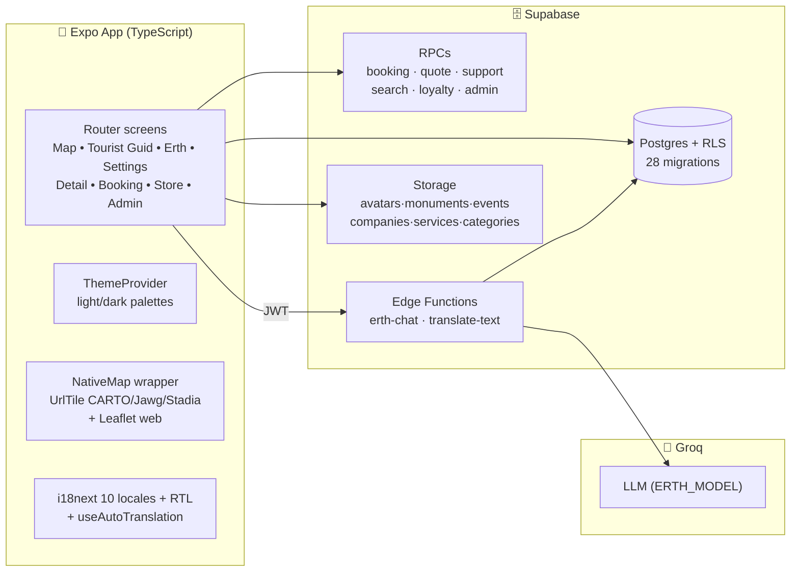

<div align="center">


# 🇯🇴 Jordan Tourism Guide

### دليل السياحة الأردنية — Discover Jordan, from Petra to Aqaba

[](https://expo.dev)
[](https://reactnative.dev)
[](https://supabase.com)
[](https://www.typescriptlang.org)
[](#-license)

**A production-ready, map-first tourism platform for Jordan** — tourists explore monuments, events and local businesses on a live map, book experiences with transactional integrity and demand pricing, and chat with **Erth / إرث**, an AI guide grounded in real database prices. Dark/Light mode, 10 languages, governorate-based discovery, and auto-translated descriptions included.

</div>

---

## 📑 Table of Contents

- [✨ Highlights](#-highlights)
- [📱 Tourist App](#-tourist-app)
- [🛡️ Admin Dashboard](#️-admin-dashboard)
- [💰 Smart Pricing Engine](#-smart-pricing-engine)
- [🎫 Booking System](#-booking-system)
- [🤖 Erth AI Guide](#-erth-ai-guide)
- [🏗️ Architecture](#️-architecture)
- [🛠️ Tech Stack](#️-tech-stack)
- [📁 Project Structure](#-project-structure)
- [🚀 Getting Started](#-getting-started)
- [🔐 Roles & Permissions](#-roles--permissions)
- [🧪 Testing](#-testing)
- [📦 Builds & Deployment](#-builds--deployment)
- [🗄️ Database](#️-database)
- [🌍 Internationalization](#-internationalization)
- [🛟 Troubleshooting](#-troubleshooting)
- [🗺️ Roadmap](#️-roadmap)
- [📝 Store Listing](#-store-listing)
- [📄 License](#-license)

---

## ✨ Highlights

| | |
|---|---|
| 🗺️ | **Map-first home** — live markers, user location, preview cards, Google-Maps directions, day/night tile styles (Jawg / Stadia / MapTiler) |
| 📍 | **Near Event by governorate** — GPS auto-detects 1 of Jordan's 12 governorates and shows only its companies + events (manual picker fallback) |
| 🔍 | **Typo-tolerant search** — debounced server-side `search_places` RPC across companies + monuments + events |
| 💸 | **Smart pricing** — demand-driven increases (up to +20%), unlimited overbooking past 100%, surcharges auto-fund matching discounts for the nearest event |
| 🎟️ | **Transactional bookings** — capacity locks, authoritative server prices × people, coupons + loyalty points, `JOR-` references, CARD/PAYPAL test checkout |
| 🌙 | **Dark / Light mode** — persisted theme across all 60+ screens, night maps included, switch in Settings → Appearance |
| 🤖 | **Erth / إرث AI** — Groq-powered guide that answers only from live DB data, with transport advice and location awareness |
| 🌐 | **10 languages + auto-translate** — EN AR FR DE ES IT RU TR ZH NL with full RTL; place descriptions auto-translate via cached edge function |
| 🏢 | **Sub-companies** — big companies own branches, shown on the company page |
| 🔒 | **Security-first** — RLS on every table, server-side role/price/capacity checks, save-guard sanitizer, zero secrets in the client |

---

## 📱 Tourist App

### Launch flow
```
Splash 🇯🇴 → Onboarding → Login / Register (username OR email, citizen/tourist, currency)
→ role routing → Map home (tourist) or Dashboard (admin)
```

### Tabs (fixed order)
| # | Tab | Route |
|---|---|---|
| 1 | 🗺️ Map | `/(tabs)/map` — live map, markers, search, profile chip, night style in Dark mode |
| 2 | 🧭 Tourist Guid | `/(tabs)/monument` — cinematic hero, floating search, category chips, Near Event governorate filter, premium activity cards |
| 3 | ✨ Erth | `/(tabs)/erth` — AI chat guide, persisted history |
| 4 | ⚙️ Settings | `/(tabs)/profile` — Wadi Rum hero, profile card, loyalty card, icon settings group, Appearance (Light/Dark + Save) |

### Screens
| Screen | Route | What it does |
|---|---|---|
| 🏛️ Monument | `/monument/[id]` | Photos, rating, tourist + citizen prices, map, directions, reviews + write-a-review |
| 🎉 Event | `/event/[id]` | Same premium shell: info, prices, map, reviews |
| 🏢 Company | `/company/[id]` | Premium page: hero gallery, info, featured service + booking bottom-sheet (date strip, people stepper, live total), map + directions, services, branches, reviews, sticky Book Now |
| 🧭 Service | `/service/[id]` | Live quote, capacity, support badge → booking flow |
| 🎫 Booking | `/booking/new` → `/booking/pay` → `/booking/[id]` | Date + people (prefillable via URL), coupons, live total = unit × people, test checkout, receipt |
| 🎁 Loyalty / Store | `/loyalty`, `/store`, `/transactions` | QR scan points, EARTH coupons, history + QR PDFs |
| ❤️ Favorites · 🔔 Notifications · 🌐 Language · 🔎 Search · 📷 Scan | — | Standard flows, all themed + back-buttoned |

---

## 🛡️ Admin Dashboard

One home, every section with a **← back header**. Role-gated (`AdminGate`).

| Section | Route | Manages |
|---|---|---|
| 🏢 Companies | `/admin/companies` | Listings, verified/active toggles, governorate, tourist + citizen prices, QR (regen + PDF), **branches/sub-companies** |
| 🎉 Events | `/admin/events` | Dates, capacity, prices, governorate, PLUS promotions, support config |
| 🗿 Monuments | `/admin/monuments` | Photos + gallery, prices (tourist + citizen), verified/active toggles |
| 🧭 Services | `/admin/services` | Base + citizen price, capacity, availability window, dynamic-pricing flags |
| 🗂️ Categories | `/admin/categories` | Category names, types, images |
| 🎫 Bookings | `/admin/bookings` | All bookings + customers, status via secure RPC (audit + notification) |
| 💲 Pricing | `/admin/pricing` | Live quotes per service (base → increase → support → final) |
| 🎁 Discounts / Support | `/admin/discounts`, `/admin/support-pricing` | Manual + auto support records, red-source/green-target map |
| ⭐ Promotions | `/admin/event-promotions` | PLUS tiers, scheduling, EARTH batch minting |
| 🛍️ Store | `/admin/store-items` | Coupon items, points costs |
| ✍️ Reviews | `/admin/reviews` | Moderate tourist reviews |
| 📜 Activity | `/admin/activity` | Own actions (boss: all) |
| 👑 Administrators | `/admin/administrators` | Roles (boss only) |
| ⚙️ Settings / 👤 Profile | `/admin/settings`, `/admin/profile` | App settings, admin account |

> First boss bootstrap (SQL Editor): `insert into user_roles (user_id, role) select id,'boss_admin' from auth.users where email='YOU@EMAIL.COM' on conflict (user_id) do update set role='boss_admin';` then log out/in.

---

## 💰 Smart Pricing Engine

Demand pays it forward — and sell-outs never block booking.

```
capacity% = current_booking / max_booking × 100   (can exceed 100: overbooking)
        │
        ▼
bands → increase%   0–49:+0 · 50–69:+5 · 70–84:+10 · 85–109:+15 · 110+:+20 (max)
        │
dynamic = base_price + increase        (citizen base for citizens when set)
        │
≥100% bookings ──► nearest active event ≤25 km gets a 48h discount = increase%
        │               (one live row per service, refreshed as it grows)
        ▼
client total = final_price × people − points − coupon   (server-authoritative)
```

All computed in `calculate_price_quote` / `allocate_support_from_service` / `create_booking` — the client displays but never decides. Bands live in `pricing_rules` (custom rows untouched by migrations).

---

## 🎫 Booking System

- **Transactional `create_booking` RPC** — locks capacity, re-computes the authoritative price, snapshots it, `JOR-YYYY-XXXXXX` reference, notification
- **No capacity cap** — overbooking allowed while active; price rises instead of blocking
- Quantity + date (+ URL prefill `?service_id=&date=&qty=`), coupons (EARTH-…), loyalty points, live `unit × people` totals on both booking pages
- Status lifecycle via `admin_set_booking_status`: `pending → confirmed / rejected / cancelled / completed`, audit-logged + notified

---

## 🤖 Erth AI Guide (+ auto-translate)

Secure Edge Functions — keys **never leave the server** (`erth-chat`, `translate-text`).

```
App (tourist JWT) ──POST──▶ erth-chat ── verify JWT ── live DB context ── Groq ── persist chat
App ──POST──▶ translate-text ── JWT ── place_translations cache ── Groq (miss only)
```

- Erth: user's language, no greetings, prices only from DB, transport advice (JETT/bus/taxi/car), location-aware nearby picks
- Translate: ar/en served from columns, other 8 languages translated once then cached; silent fallback to source
- **Setup:** secrets `GROQ_API_KEY` (+ optional `ERTH_MODEL`) on each function, then:
```powershell
npx supabase functions deploy erth-chat --project-ref <ref>
npx supabase functions deploy translate-text --project-ref <ref>
```

---

## 🏗️ Architecture



**Key principle:** the client is a *view layer*. Prices, capacity, roles, distances and discounts are enforced in Postgres/RLS/RPCs; `lib/saveGuard.ts` additionally strips unknown columns so older databases degrade gracefully instead of breaking saves.

---

## 🛠️ Tech Stack

| Layer | Technology |
|---|---|
| App | Expo SDK **57**, Expo Router (file-based), React **19.2**, RN **0.86.3** |
| Maps | `react-native-maps` + `UrlTile` (Jawg / Stadia / MapTiler, key in `constants/mapStyle.ts`) + Leaflet web — day/night auto-switch |
| Theme | `lib/theme.tsx` — persisted Light/Dark, `useTheme()` + screen palettes |
| Animation | Reanimated 4.5, Gesture Handler, bottom sheets, staggered entrances |
| Icons / Media | `lucide-react-native`, `expo-image`, `expo-image-picker`, `expo-location`, QR (`react-native-qrcode-svg` + PDF export) |
| i18n | `i18next`, 10 locales, AsyncStorage persistence, RTL |
| Backend | Supabase: Postgres + Auth + Storage + RLS + Edge Functions (Deno), `@supabase/supabase-js` 2.45 |
| AI | Groq API (OpenAI-compatible), model via `ERTH_MODEL` |
| Language | TypeScript strict (`tsc --noEmit` clean) |
| Tests | Jest — thresholds, support math, caps, validation, ranking |

---

## 📁 Project Structure

```
app/                        # Expo Router routes (every file = a screen)
  index.tsx                 # Splash → onboarding / login / map
  (auth)/                   # onboarding, login, register, forgot/reset-password
  (tabs)/                   # map • Tourist Guid • erth • profile
  monument/[id].tsx         # DetailShell (monuments + events) + translate
  company/[id].tsx          # premium page + booking sheet + branches
  service/[id].tsx  event/[id].tsx  store*.tsx  booking/…  settings, language…
  admin/                    # dashboard + manage sections (+ create/edit)
components/
  admin/                    # AdminHeader, AdminList, *Form (save-guarded), fields
  maps/                     # NativeMap (+ .web), LeafletWeb, PreviewCard
  cards/ reviews/ booking/ ui/   # ActivityCard, ReviewsSection, PriceBreakdown, BackButton…
hooks/  lib/                # useErth, useAuth, useFavorites… / supabase, theme, translate, saveGuard, currency…
constants/  locales/{en,ar,fr,de,es,it,ru,tr,zh,nl}/  assets/
supabase/
  migrations/               # 0001 → 0031 (or just run 0028_catchup.sql)
  functions/erth-chat|translate-text/
```

---

## 🚀 Getting Started

### Prerequisites
- Node.js LTS, npm · Supabase project · Expo Go (SDK 57) · Groq key (AI + translate) · tile key (optional, maps work keyless via CARTO)

### 1️⃣ Install / env
```bash
npm install
cp .env.example .env   # EXPO_PUBLIC_SUPABASE_URL + KEY (public, safe)
```
Secrets (`GROQ_API_KEY`, optional `ERTH_MODEL`) live in Supabase → Edge Functions → Secrets — **never** `EXPO_PUBLIC_`.

### 2️⃣ Database — ONE file
In Supabase **SQL Editor**, run the whole `supabase/migrations/0028_catchup.sql` (idempotent; replaces running 0001→0027 individually), then:
```sql
NOTIFY pgrst, 'reload schema';
```

### 3️⃣ Auth / AI / maps
- Auth → enable **Email** provider
- Deploy functions (CLI or dashboard paste): `erth-chat`, `translate-text`
- Maps: optional keys in `constants/mapStyle.ts` (`JAWG_TOKEN` → glowing night, `TILE_API_KEY` Stadia, else keyless CARTO)

### 4️⃣ Run
```bash
npx expo start -c
```
First boss: SQL in [Roles](#-roles--permissions), log out/in → `/admin`.

---

## 🔐 Roles & Permissions

| Capability | `user` | `admin` | `boss_admin` |
|---|---|---|---|
| Browse, book, review, Erth, loyalty | ✅ | ✅ | ✅ |
| Manage companies/events/services/monuments/categories | — | ✅ | ✅ |
| Pricing, discounts, promotions, support, store | — | ✅ | ✅ |
| Reviews moderation, bookings control | — | ✅ | ✅ |
| Activity logs (own / **all**) | own | own | ✅ all |
| Administrators (roles) | — | — | ✅ |

Public signup creates `user` only. Sensitive actions re-checked server-side; hidden buttons are UX, not security.

---

## 🧪 Testing

```bash
npm test            # Jest
npx tsc --noEmit    # strict typecheck (clean ✅)
npx expo export --platform all --output-dir dist
```

---

## 📦 Builds & Deployment

```bash
npx expo export --platform all --output-dir dist   # Android + iOS + Web ✅ (Leaflet maps on web)
eas build -p android|ios                           # native binaries (projectId in app.json)
```
- OTA via `expo-updates` · Cron `expire_stale()` for promo/discount expiry

---

## 🗄️ Database

- **Tables:** `profiles`, `user_roles`, `monuments` (+prices/flags), `events` (+governorate), `companies` (+governorate/prices/QR/parent), `services` (+dual pricing), `pricing_rules`, `event_support_discounts` (+service source), `event_promotions`, `bookings`, `reviews`, `favorites`, `loyalty_*`, `store_items`, `coupons`, `place_translations`, `notifications`, `ai_*`, `app_settings`, `admin_activity_logs`
- **RPCs:** `create_booking` · `calculate_price_quote` · `allocate_support_discount` · `allocate_support_from_service` · `loyalty_scan` · `buy_store_item` · `mint_store_codes` · `make_promo_code` · `search_places` (+ legacy `search_companies`) · `admin_*` · `boss_*` · `resolve_login_email` · `expire_stale`
- **RLS** on everything with admin policies; money/status only via `SECURITY DEFINER` RPCs.

---

## 🌍 Internationalization

- 10 locales (`en ar fr de es it ru tr zh nl`), persisted, full RTL (mirrored rows, chevrons, sheets)
- Place descriptions auto-translate server-side with cache; UI strings verified across all locales
- Erth + translate functions reply in the user's language

---

## 🛟 Troubleshooting

| Symptom | Fix |
|---|---|
| Save says "Database is behind the app" | Run `0028_catchup.sql`, then `NOTIFY pgrst, 'reload schema';`, wait 30s, `npx expo start -c` |
| "Not an administrator" on save (as admin) | Check `user_roles` for your email; promote to `boss_admin`; log out/in |
| Verify button missing | Only Companies have it (by design); Events/Services/Monuments don't |
| Admin bookings empty | No bookings yet, or check RLS/role |
| Map tiles blank | No internet, or tile key revoked/quota — clear the key to fall back to CARTO |
| Erth `401` / `missing GROQ_API_KEY` | Log in first; add secret on the **deployed** function + redeploy |
| Stale UI after code changes | Always restart with `-c` (clears Metro cache) |
| Web export map issues | Never import `react-native-maps` directly — use `components/maps/NativeMap` |

---

## 🗺️ Roadmap

- [ ] Push notifications for booking status
- [ ] Live payment gateway (Stripe/PayPal live)
- [ ] Tourist itinerary builder + shareable trip links
- [ ] Offline map packs for Petra / Wadi Rum
- [ ] Review photos + moderation queue

---

## 📝 Store Listing

> Ready-to-paste text for Google Play / App Store (English + Arabic).

**Tagline:**
Discover Jordan like never before — live maps, smart booking, Erth AI guide. 10 languages, Dark mode.

**Full description:**

Welcome to Jordan — Petra, Wadi Rum, Jerash, the Dead Sea, Aqaba and beyond, all in one app.

🗺️ **MAP-FIRST DISCOVERY**
Live map with day/night styles, Near-Event governorate picks, typo-proof search, directions.

🎫 **SMART BOOKING**
Live availability with overbooking, demand prices, citizen rates, multi-currency, coupons + loyalty points, card/PayPal.

🤖 **ERTH — YOUR AI GUIDE (إرث)**
Itineraries, transport, nearby picks, real prices — in your language.

🎁 **LOYALTY THAT PAYS**
Scan store QRs, earn points, EARTH coupons, transaction history.

⭐ **COMMUNITY**
Verified badges, photo reviews, favorites, notifications, full RTL Arabic + 9 more languages.

📲 Download Jordan Tourism Guide — من البتراء إلى العقبة.

---

## 📄 License

Proprietary — © Jordan Tourism Guide. All rights reserved. Contact the maintainers for licensing.

---

<div align="center">

**Made with ❤️ for Jordan** — من البتراء إلى العقبة، ومن جرش إلى وادي رم 🇯🇴

`jordanguide` · `com.jordanguide.app` · v1.0.0

</div>
